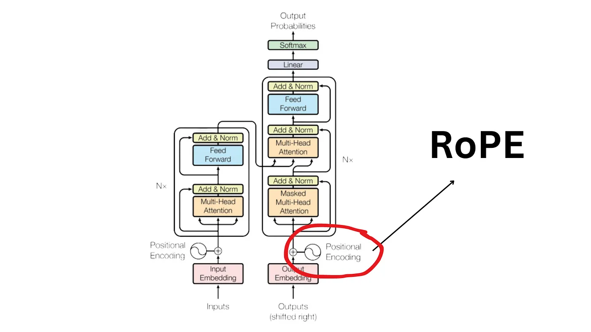

### Key takeaways
- Latest encoder-only transformer model. Biggest leap since RoBERTa.
- Developed by Answer.AI 
- Modernized transformer architecture
- Attention to efficiency
- Increased data scales and sources

### Links
[Huggingface model](https://huggingface.co/docs/transformers/main/en/model_doc/modernbert)

### Training details

- 2 trillion tokens
- Native sequence length 8192 tokens

### Architectural improvements

#### Rotary positional embeddings
This was first introduced in RoFormer paer https://arxiv.org/pdf/2104.09864. The goal for position encoding is to enable supervision for dependency modeling between elements at different positions of the sequence.
RoPE encodes the absolute position with a rotation matrix and meanwhile incorporates the explicit relative position dependency in self attention formulation. 
- Flexibility of sequence length
- Decaying inter-token dependency with increasing relative distances
- Capability if equipping the linear self-attention with relative position encoding. 

#### Bias terms
What are bias terms?

